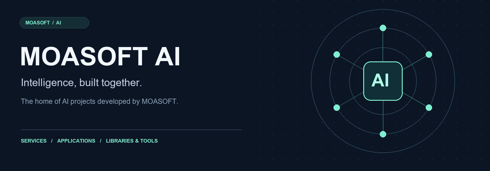

  

  <strong>The official GitHub organization for AI projects by MOASOFT Corp.</strong>

  A shared space for the source code, projects, and collaboration 
  behind AI services and software developed and operated by MOASOFT.

 

### Our focus

| AI Services | Applications | Libraries & Tools |
| :--- | :--- | :--- |
| AI services developed and operated by MOASOFT. | Applications across MOASOFT's AI projects. | Shared libraries and development tools for AI projects. |

 

### One space. Connected projects.

This organization brings together MOASOFT's AI-related repositories — a central place to manage projects, collaborate on source code, and share development resources.

---

  <strong>MOASOFT AI</strong> &nbsp; / &nbsp; Services · Applications · Libraries · Development tools

